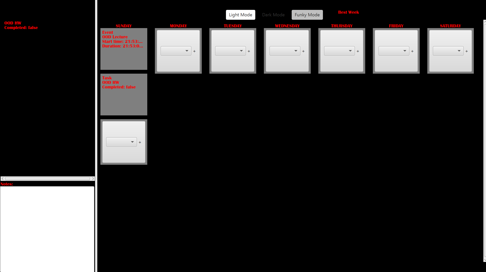

# 3500 PA05 Project Repo

[PA Write Up](https://markefontenot.notion.site/PA-05-8263d28a81a7473d8372c6579abd6481)

# Deployable Application
## How to run [journal.jar](journal.jar) in the root directory
### Windows
- Add this to the VM options:
- --module-path windowModules/lib --add-modules javafx.fxml --add-modules javafx.controls
### Mac
- Add this to the VM options:
- --module-path macModules/lib --add-modules javafx.fxml --add-modules javafx.controls
### How to add VM Options
- Right click on journal.jar
- More Run/Debug -> Modify Run Configuration...
- Add the commands above into the VM options field and press OK
### Run journal.jar
- In IntelliJ, right click on journal.jar and click "Run 'journal.jar'" after adding VM options
### Run journal.jar on console
- Mac
  - java --module-path macModules/lib --add-modules javafx.fxml --add-modules javafx.controls -jar journal.jar
- Windows
  - java --module-path macModules/lib --add-modules javafx.fxml --add-modules javafx.controls -jar journal.jar

